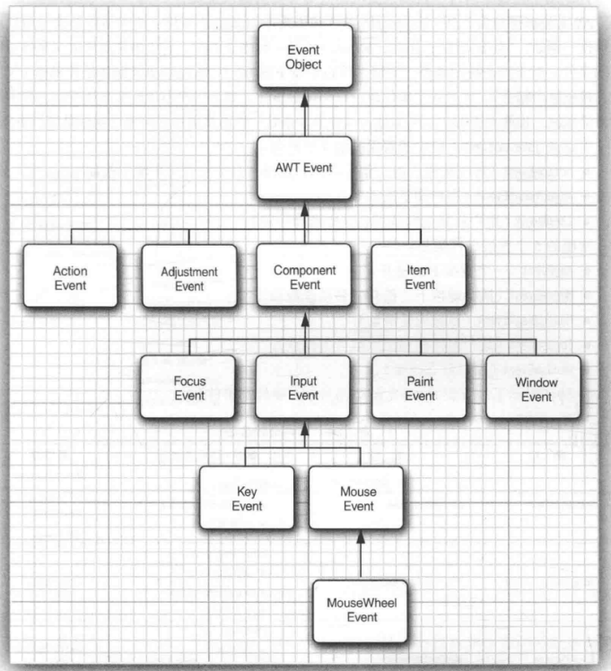

任何支持GUI的操作环境会持续监视按键或点击鼠标之类的事件。这些事件再报告给正 在运行的程序。

每个程序将决定如何对这些事件做出响应（如果确实有事件发生）。

### 10.4.1 基本事件处理概念

### 10.4.2 实例：处理按钮点击事件

一个响应按钮点击事件的简单示例

### 10.4.3 简洁地指定监听器

只需要使用一个lambda表达式

### 10.4.4 适配器类

每个包含多个方法 的AWT监听器接口都配有一个适配器(adapter).类，这个类实现了接口中的所有方法，但每 个方法并不做任何事情。

### 10.4.5 动作

动作(action)是封装以下内容的一个对象：
- 命令的描述
- 执行命令所需要的参数

### 10.4.6 鼠标事件

捕 获鼠标移动、点击和拖动事件。

### 10.4.7 AWT 事件继承层次结构

EventObject类有一个子类AWTEvent,它是所有AWT事件类的父类。

