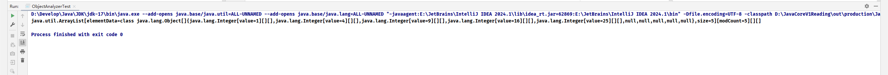

反射库 ( reflection library) 提供了一个丰富且精巧的工具集，可以用来编写动态操纵 Java 代码的程序

能够分析类能力的程序称为可反射 ( reflective)

1. 运行时分析类的能力
2. 运行时检查对象
3. 实现泛型数组操作代码
4. 利用 Method 对象，像 C++ 中的函数指针

---

### 5.9.1 Class 类

Object 类中的 getClass() 方法将会返回一个 Class 类型的实例, Class 对象会描述一个特定类的属性。

最常用的 Class 方法就是 getName 这个方法将返回类的名字。

> Class 类实际上是一个泛型类。

虚拟机为每个类型管理一个唯一的 Class 对象。

### 5.9.2 声明异常入门
异常有两种类型：非检查型（ unchecked）异常和检查型（ checked）异常。

### 5.9.3 资源

类通常有一些关联的数据文件. 例如：
- 图像和声音文件。
- 包含消息字符串和按钮标签的文本文件

在 Java 中，这些关联的文件被称为资源（resource）

### 5.9.4 利用反射分析类的能力

反射机制最重要的内容，允许我们检查类的结构.

java.lang.reflect 包中有三个类 Field、Method 和 Constructor, 分别用于描述类的字段、方 法和构造器。

Class 类中的 getFields , getMethods 和 getConstructors 方法将分别返回这个类支持的公共字段、方法和构造器的数组，其中包括超类的公共成员。

### 5.9.5 使用反射在运行时分析对象

一个可用于任意类的通用 toString() 方法

jvm 参数和命令行参数还是不一样的

### 5.9.6 使用反射编写泛型数组代码

java.lang.reflect 包中的 Array 类允许动态地创建数组。

### 5.9.7 调用任意方法和构造器

反射机制允许你调用任意的方法

利用 Method 对象可以实现 C 语言中函数指针所能完成的所有操作。