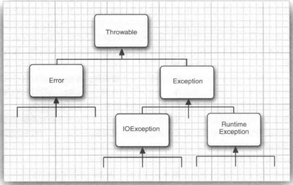

程序中可能出现的错误和问题：

- 用户输入错误
- 设备错误
- 物理限制
- 代码错误

### 7.1.1 异常分类

在 Java 程序设计语言中，异常对象都是派生于 Thromble 类的一个类的实例.【用户也可以创建自己的异常类】

如果出现 RuntuneException 异常，那么一定是你的问题【 ... 】

Java 语言规范将派生于 Error 类或 RuntimeException 类的所有异常称为非检查型（unchecked） 异常，所有其他异常称为检查型（ checked）异常

### 7.1.2 声明检查型异常

总之，一个方法必须声明所有可能抛出的检查型异常，而非检查型异常要么在你的控制 之外 ( Error )， 要么是由从一开始就应该避免的情况导致的 ( RuntimeException )。

### 7.1.3 如何抛出异常

1. 找到一个合适的异常类。
2. 创建这个类的一个对象
3. 将对象抛出

一旦方法抛出了异常，这个方法就不会返回到调用者。

### 7.1.4 创建异常类

我们要做的只是定义一个派生于 Exception  的类，或者派生于 Exception 的某个子类

