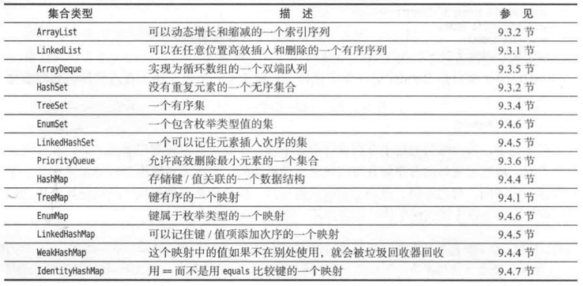

### 9.3.1 链表

Java 集合类库提供 了一个可以直接使用的 LinkedList 类

### 9.3.2 数组列表

我们熟悉的 ArrayList 类. 这个类也实现了 List 接口。AirayList 封装了一个动 态再分配的对象数组。

### 9.3.3 散列集

可以用于快速地查找对象，这就是散列表(hash table)

在 Java 中，散列表实现为链表数组。每个列表被称为桶【在 Java 8 中，桶满时会从链表变为平衡二叉树】

Java 集合类库提供了一个 HashSet 类，它基于散列表实现了一个集

### 9.3.4 树集

树集是一个有序集合 ( sorted collection). 可以以任意顺序将元素插入集合中
在对集合进行遍历时，值将自动地按照排 序后的顺序出现。

### 9.3.5 队列与双端队列

双端队列(deuqe) 在队头和队尾都能高效地添加或删除元素。不支持在队列中问添加元素 

### 9.3.6 优先队列

优先队列 ( priority queue ) 中的元素 可以按照任意的顺序插人，但会按照有序的顺序获 取

